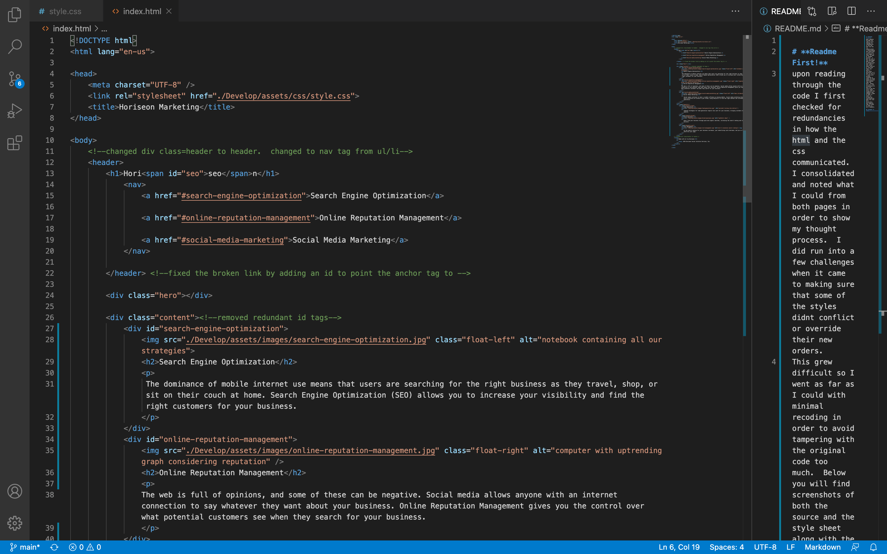
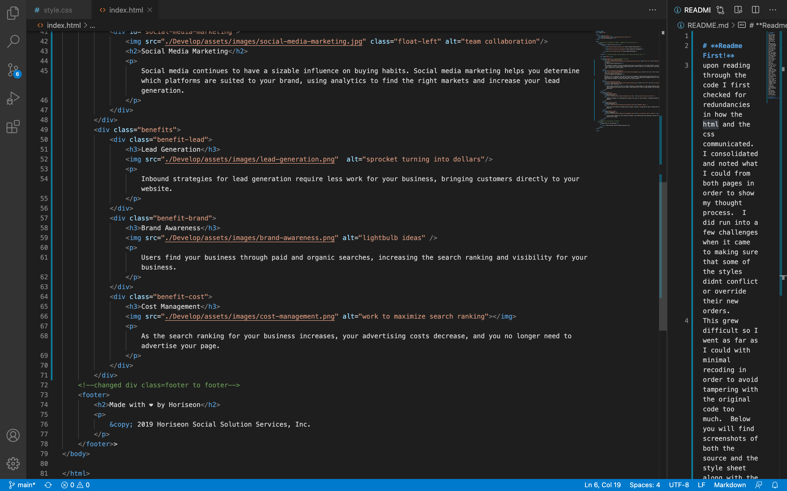
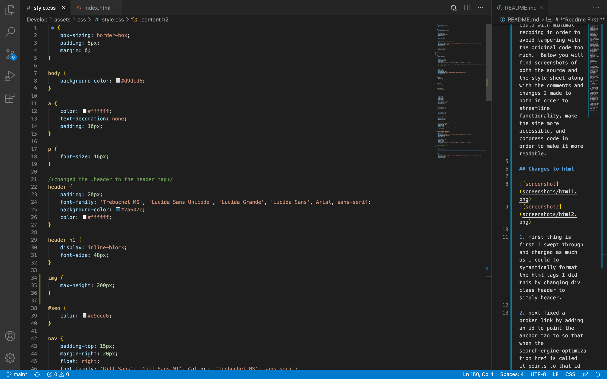
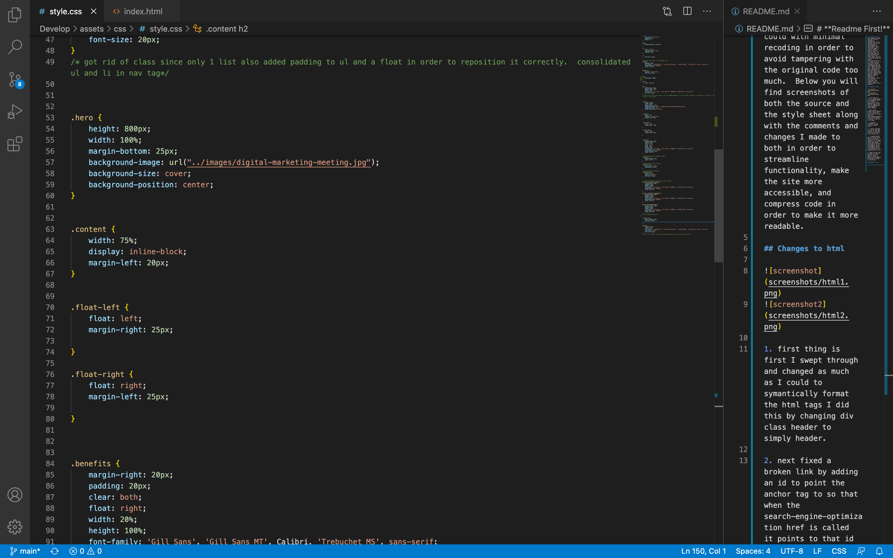
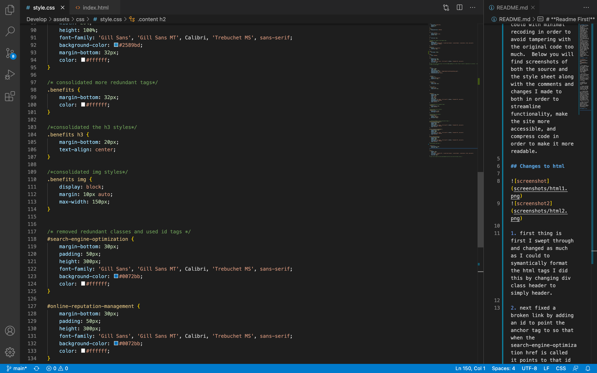
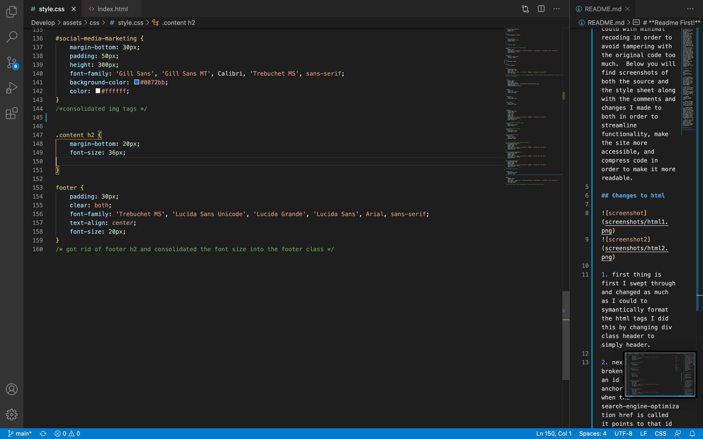

# **Readme!**
upon reading through the code I first checked for redundancies in how the html and the css communicated.  I consolidated and noted what I could from both pages in order to show my thought process.  I did run into a few challenges when it came to making sure that some of the styles didnt conflict or override their new orders.
This grew difficult so I went as far as I could with minimal recoding in order to avoid tampering with the original code too much.  Below you will find screenshots of both the source and the style sheet along with the comments and changes I made to both in order to streamline functionality, make the site more accessible, and compress code in order to make it more readable.

## Changes to html

1. first thing is first I swept through and changed as much as I could to symantically format the html tags I did this by changing div class header to simply header.

2. next fixed a broken link by adding an id to point the anchor tag to so that when the search-engine-optimization href is called it points to that id on the page.

3. I removed redundant id tags from the content class.

4. I again formatted some of the div tags in order to include syntax for html such as the footer tag.

5.  I played around quite a bit with the hero tag trying to change it to a figure tag but ran into some issues that would have made me refactor and change a lot of code between the two so decided to hold the integrity of the example and let it go.

6. After all was said and done I tried to shorten the file paths in order to make it more readable and easier to alter in the future.

## Changes to css

1. The first step was to change all of the tags to cooperate with the changes to the index.  changing the div soup into headers and footers to match content on both sides.

2. I got rid of class since only 1 list also added padding to ul and a float in order to reposition it correctly.

3. I consolidated ul and li in the nav tag as well.

4. I also consolidated all of the redundant tags under the benefit class.

5. I went through and consolidated all of the h3 styles and the img styles as well.

6. Along with all of the consolidation I tried to go through and make sure that the integrity of the site was still the same.  I did this by making sure that everything was still sized correctly.  In some instances I had to slightly modify some padding or margins.

